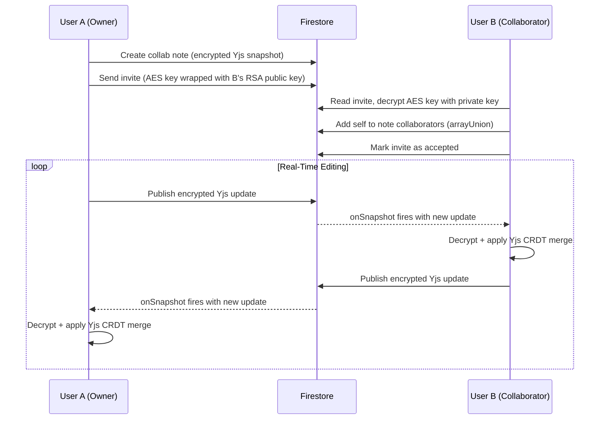

# 📝 Notes Taker

> A secure, encrypted, real-time collaborative notes platform built with **Next.js 16**, **Firebase**, and **Web Crypto API**.

---

## ✨ Features

### 📓 Three Note Modes

| Mode | Icon | Description |
|------|------|-------------|
| **Normal** | 📄 | Standard plaintext notes with full CRUD |
| **Encrypted** | 🔒 | End-to-end encrypted notes using AES-256-GCM + RSA-OAEP 4096-bit |
| **Collaborative** | 👥 | Real-time multi-user editing with encrypted Yjs CRDT sync |

### 🔐 End-to-End Encryption
- **AES-256-GCM** for note encryption with random 12-byte IVs
- **RSA-OAEP 4096-bit** keypairs per user for secure key exchange
- **PBKDF2 → AES-KW** vault password system for cross-device private key sync
- **Zero-knowledge architecture** — the server never sees plaintext data

### 👥 Real-Time Collaboration
- **Yjs CRDT** engine for conflict-free real-time text editing
- **Encrypted updates** — every Yjs update is AES-encrypted before syncing via Firestore
- **Live presence** with heartbeat-based tracking (15s interval, 30s TTL)
- **Automatic snapshot compaction** every 50 updates for performance
- **Manual Save** button for explicit persistence

### 🤝 Friend System
- Search users by email and send friend requests
- Accept/reject incoming requests with real-time notifications
- Manage your friends list with remove functionality

### 🎨 UI/UX
- **Glassmorphism + Neubrutalism** design system
- **Framer Motion** animations throughout
- **Responsive design** — works on desktop and mobile
- **Dark/Light** theming support
- **Mode badges** and visual indicators for note types
- **Live presence avatars** in collaborative editor

### 📁 Groups & Organization
- Create color-coded groups to organize notes
- Filter notes by group, date, or mode
- Assign notes to multiple groups

---

## 🏗️ Architecture

```
┌─────────────────────────────────────────────────┐
│                  Client (Browser)                │
│                                                  │
│  ┌──────────┐  ┌──────────┐  ┌───────────────┐  │
│  │   React   │  │ Web      │  │  Yjs CRDT     │  │
│  │   + Next  │  │ Crypto   │  │  Engine       │  │
│  │   UI      │  │ API      │  │               │  │
│  └─────┬─────┘  └─────┬────┘  └──────┬────────┘  │
│        │              │              │            │
│  ┌─────┴──────────────┴──────────────┴─────────┐  │
│  │            IndexedDB (idb-keyval)            │  │
│  │         (Private key local storage)          │  │
│  └──────────────────────┬──────────────────────┘  │
└─────────────────────────┼─────────────────────────┘
                          │
                          ▼
┌─────────────────────────────────────────────────┐
│                 Firebase                         │
│                                                  │
│  ┌──────────────┐  ┌────────────────────────┐   │
│  │  Firebase     │  │  Cloud Firestore       │   │
│  │  Auth         │  │                        │   │
│  │  (Google)     │  │  • notes               │   │
│  │               │  │  • groups              │   │
│  └──────────────┘  │  • users (public keys)  │   │
│                     │  • friend_requests      │   │
│                     │  • friends              │   │
│                     │  • collab_invites       │   │
│                     │  • note_updates (CRDT)  │   │
│                     │  • notes/{id}/presence  │   │
│                     └────────────────────────┘   │
└─────────────────────────────────────────────────┘
```

### Cryptographic Model

| Layer | Algorithm | Purpose |
|-------|-----------|---------|
| Note encryption | AES-256-GCM | Encrypt/decrypt note title & content |
| Key wrapping | RSA-OAEP 4096-bit | Wrap per-note AES keys for each collaborator |
| Vault backup | PBKDF2 (600K iterations) → AES-KW | Password-derived key to wrap private key for Firestore backup |
| Local storage | IndexedDB | Store private key on device |

### Collaboration Flow



---

## 🛠️ Tech Stack

| Technology | Version | Purpose |
|-----------|---------|---------|
| [Next.js](https://nextjs.org/) | 16.2.4 | React framework with App Router |
| [React](https://react.dev/) | 19.2.4 | UI library |
| [TypeScript](https://www.typescriptlang.org/) | 5.x | Type safety |
| [Firebase](https://firebase.google.com/) | 12.12.0 | Auth + Firestore database |
| [Yjs](https://yjs.dev/) | 13.6.30 | CRDT for real-time collaboration |
| [Web Crypto API](https://developer.mozilla.org/en-US/docs/Web/API/Web_Crypto_API) | Native | E2E encryption (AES-GCM, RSA-OAEP, PBKDF2) |
| [idb-keyval](https://github.com/nicedoc/idb-keyval) | 6.2.4 | IndexedDB wrapper for private key storage |
| [Framer Motion](https://www.framer.com/motion/) | 12.38.0 | Animations |
| [Lucide React](https://lucide.dev/) | 1.8.0 | Icons |
| [Zod](https://zod.dev/) | 4.3.6 | Schema validation |
| [Tailwind CSS](https://tailwindcss.com/) | 4.x | Styling |

---

## 📂 Project Structure

```
src/
├── app/                          # Next.js App Router pages
│   ├── page.tsx                  # Home — action cards dashboard
│   ├── layout.tsx                # Root layout with NavBar + AuthButton
│   ├── globals.css               # Design system tokens
│   ├── write/page.tsx            # Create notes (Normal/Encrypted/Collaborative)
│   ├── notes/page.tsx            # All notes with filters (mode, date, group)
│   ├── groups/                   # Group management
│   │   ├── page.tsx              # Groups list
│   │   └── [id]/page.tsx         # Group detail
│   ├── friends/page.tsx          # Friends, requests, collab invites
│   └── collab/[id]/page.tsx      # Real-time collaborative editor
│
├── components/                   # Reusable React components
│   ├── AuthButton.tsx            # Google sign-in/sign-out
│   ├── NavBar.tsx                # Top navigation bar
│   ├── Logo.tsx                  # App logo
│   ├── NoteCard.tsx              # Note display card
│   ├── NoteModePicker.tsx        # Mode selector (Normal/Encrypted/Collaborative)
│   ├── ModeBadge.tsx             # Mode indicator pill
│   ├── EditNoteModal.tsx         # Edit note modal (supports encrypted notes)
│   ├── ViewNoteModal.tsx         # View note modal (decrypts secure notes)
│   ├── CollabNoteEditor.tsx      # Yjs-bound textarea with presence + save
│   ├── CollaboratorManager.tsx   # Manage & invite collaborators modal
│   ├── CollabInviteCard.tsx      # Accept/reject collab invite card
│   ├── PresenceIndicator.tsx     # Animated avatar stack for live users
│   ├── FriendRequestCard.tsx     # Friend request card (incoming/outgoing)
│   ├── FriendCard.tsx            # Friend display with remove
│   ├── GroupCard.tsx             # Group card component
│   ├── CreateGroupModal.tsx      # Create group modal
│   ├── ManageGroupModal.tsx      # Manage group members/notes
│   ├── NotePickerGrid.tsx        # Note picker grid for groups
│   ├── KeySetupModal.tsx         # Vault password setup modal
│   └── VaultUnlockModal.tsx      # Vault unlock modal (for new devices)
│
├── hooks/                        # Custom React hooks
│   ├── useAuth.ts                # Firebase Auth state management
│   ├── useUserKeys.ts            # Full key lifecycle (generate → store → vault)
│   ├── useCollabEditor.ts        # Yjs lifecycle, encrypted Firestore sync
│   └── usePresence.ts            # Heartbeat-based presence tracking
│
└── lib/                          # Core libraries and services
    ├── firebaseConfig.ts         # Firebase initialization
    ├── validations.ts            # Zod schemas + discriminated union types
    ├── groupsService.ts          # Group CRUD operations
    ├── utils.ts                  # Utility functions
    └── services/
        ├── crypto/               # Encryption layer
        │   ├── encrypt.ts        # AES-256-GCM encryption
        │   ├── decrypt.ts        # AES-256-GCM decryption
        │   ├── keys.ts           # RSA keygen, IndexedDB, PBKDF2 vault wrapping
        │   ├── sharing.ts        # RSA key wrapping for collaborator key exchange
        │   └── serialization.ts  # Base64 ↔ ArrayBuffer utilities
        ├── notes/                # Note services by mode
        │   ├── normalNotesService.ts        # Normal note CRUD + dual subscription
        │   ├── secureNotesService.ts        # E2E encrypted note CRUD
        │   └── collaborativeNotesService.ts # Yjs collab note creation/loading
        └── social/               # Social features
            ├── usersService.ts           # User profiles, public keys
            ├── friendsService.ts         # Friend requests, friendships
            └── collaborationService.ts   # Collab invites, encrypted key exchange
```

---

## 🚀 Getting Started

### Prerequisites

- [Node.js](https://nodejs.org/) 18+ 
- A [Firebase](https://firebase.google.com/) project with:
  - **Authentication** enabled (Google provider)
  - **Cloud Firestore** database created

### 1. Clone the Repository

```bash
git clone https://github.com/Madhan-2711/notes_taker.git
cd notes_taker
```

### 2. Install Dependencies

```bash
npm install
```

### 3. Configure Firebase

Create a `.env.local` file in the root directory with your Firebase config:

```env
NEXT_PUBLIC_FIREBASE_API_KEY=your-api-key
NEXT_PUBLIC_FIREBASE_AUTH_DOMAIN=your-project.firebaseapp.com
NEXT_PUBLIC_FIREBASE_PROJECT_ID=your-project-id
NEXT_PUBLIC_FIREBASE_STORAGE_BUCKET=your-project.appspot.com
NEXT_PUBLIC_FIREBASE_MESSAGING_SENDER_ID=your-sender-id
NEXT_PUBLIC_FIREBASE_APP_ID=your-app-id
```

### 4. Deploy Firestore Security Rules

Copy the contents of `firestore.rules` into your Firebase Console:

1. Go to **Firebase Console → Firestore Database → Rules**
2. Paste the contents of [`firestore.rules`](firestore.rules)
3. Click **Publish**

### 5. Run the Development Server

```bash
npm run dev
```

Open [http://localhost:3000](http://localhost:3000) in your browser.

### 6. Build for Production

```bash
npm run build
npm start
```

---

## 🗄️ Firestore Collections

| Collection | Document Fields | Purpose |
|-----------|----------------|---------|
| `notes` | `mode`, `title`, `content`, `authorId`, `collaboratorIds`, `encryptedKeys`, `latestSnapshot`, `snapshotIv`, `groupIds`, `createdAt`, `updatedAt` | All notes (normal, encrypted, collaborative) |
| `groups` | `title`, `color`, `authorId`, `noteIds`, `createdAt` | Note organization groups |
| `users` | `email`, `displayName`, `photoURL`, `publicKey`, `wrappedPrivateKey`, `createdAt` | User profiles with public encryption keys |
| `friend_requests` | `senderId`, `senderEmail`, `senderName`, `receiverId`, `receiverEmail`, `receiverName`, `status`, `createdAt` | Pending/accepted/rejected friend requests |
| `friends` | `users` (array of 2 UIDs), `createdAt` | Established friendships |
| `collab_invites` | `noteId`, `senderId`, `senderName`, `receiverId`, `receiverName`, `encryptedNoteKey`, `permission`, `status`, `createdAt` | Collaboration invitations with wrapped keys |
| `note_updates` | `noteId`, `senderId`, `encryptedUpdate`, `iv`, `createdAt` | Encrypted Yjs CRDT updates for real-time sync |
| `notes/{id}/presence` | `displayName`, `photoURL`, `lastSeen` | Live user presence per note |

---

## 🔒 Security Model

### Firestore Security Rules

The app uses comprehensive security rules that enforce:

- **Notes**: Only the author or listed collaborators can read/update. A user with a pending invite can also read and add themselves as a collaborator.
- **Users**: Any authenticated user can read profiles (for public key access). Only the owner can write their own profile.
- **Friend Requests**: Only sender and receiver can read. Only the receiver can accept/reject.
- **Friends**: Only the two users in the friendship can read/delete.
- **Collab Invites**: Only sender and receiver can access. Both can update (sender to re-invite, receiver to accept/reject).
- **Note Updates**: Only note author/collaborators can read. Only authenticated users can create (for their own updates). Updates are immutable.

### Vault Password System

When a user first creates encrypted/collaborative notes:
1. An RSA-OAEP 4096-bit keypair is generated in the browser
2. The **private key** is stored locally in IndexedDB
3. The **public key** is stored in Firestore (accessible to all authenticated users)
4. The user is prompted to set a **vault password** which wraps their private key using PBKDF2 → AES-KW and stores it in Firestore

On a new device:
1. The app detects no local private key
2. Finds the wrapped private key in Firestore
3. Prompts the user for their vault password
4. Unwraps the private key locally and stores it in IndexedDB

---

## 📜 Routes

| Route | Type | Description |
|-------|------|-------------|
| `/` | Static | Home dashboard with action cards |
| `/write` | Static | Create notes (mode selection → form) |
| `/notes` | Static | All notes with mode, date, and group filters |
| `/groups` | Static | Group management |
| `/groups/[id]` | Dynamic | Group detail with note management |
| `/friends` | Static | Friends, requests, and collaboration invites |
| `/collab/[id]` | Dynamic | Real-time collaborative editor with presence |

---

## 🤝 Contributing

1. Fork the repository
2. Create a feature branch (`git checkout -b feature/amazing-feature`)
3. Commit your changes (`git commit -m 'feat: add amazing feature'`)
4. Push to the branch (`git push origin feature/amazing-feature`)
5. Open a Pull Request

---

## 📄 License

This project is private. All rights reserved.

---

<p align="center">
  Built with ❤️ using Next.js, Firebase, and Web Crypto API
</p>
