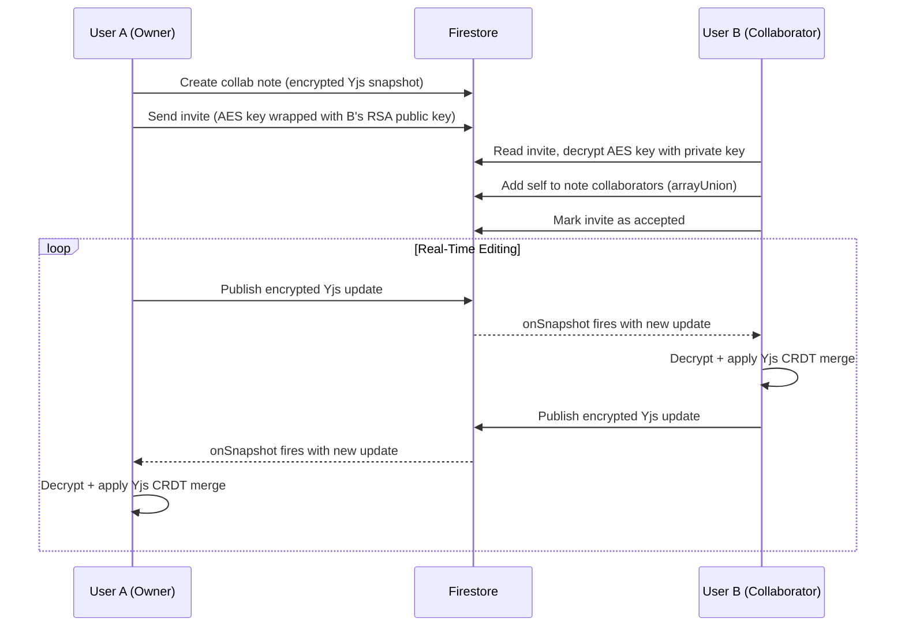

# 📝 Notes Taker

> A secure, encrypted, real-time collaborative notes platform built with **Next.js 16**, **Firebase**, and **Web Crypto API**.

---

## ✨ Features

### 📓 Three Note Modes

| Mode | Icon | Description |
|------|------|-------------|
| **Normal** | 📄 | Standard plaintext notes with full CRUD |
| **Encrypted** | 🔒 | End-to-end encrypted notes using AES-256-GCM + RSA-OAEP 4096-bit |
| **Collaborative** | 👥 | Real-time multi-user editing with encrypted Yjs CRDT sync |

### 🔐 End-to-End Encryption
- **AES-256-GCM** for note encryption with random 12-byte IVs
- **RSA-OAEP 4096-bit** keypairs per user for secure key exchange
- **PBKDF2 → AES-256-GCM** versioned vault backups with a random per-backup salt
- Encrypted secure-note content and encrypted collaborative titles/content; normal notes remain plaintext by design

### 👥 Real-Time Collaboration
- **Yjs CRDT** engine for conflict-free real-time text editing
- **Encrypted updates** — every Yjs update is AES-encrypted before syncing via Firestore
- **Live presence** with heartbeat-based tracking (10s interval, 30s TTL)
- **Incremental Yjs updates**, merged during a short debounce and encrypted before upload
- **Owner-only lossless checkpointing** that deletes only updates represented by the snapshot

### 🤝 Friend System
- Search users by email and send friend requests
- Accept/reject incoming requests with real-time notifications
- Manage your friends list with remove functionality

### 🎨 UI/UX
- **Glassmorphism + Neubrutalism** design system
- **Framer Motion** animations throughout
- **Responsive design** — works on desktop and mobile
- **Dark/Light** theming support
- **Mode badges** and visual indicators for note types
- **Live presence avatars** in collaborative editor

### 📁 Groups & Organization
- Create color-coded groups to organize notes
- Filter notes by group, date, or mode
- Assign notes to multiple groups

---

## 🏗️ Architecture

```
┌─────────────────────────────────────────────────┐
│                  Client (Browser)                │
│                                                  │
│  ┌──────────┐  ┌──────────┐  ┌───────────────┐  │
│  │   React   │  │ Web      │  │  Yjs CRDT     │  │
│  │   + Next  │  │ Crypto   │  │  Engine       │  │
│  │   UI      │  │ API      │  │               │  │
│  └─────┬─────┘  └─────┬────┘  └──────┬────────┘  │
│        │              │              │            │
│  ┌─────┴──────────────┴──────────────┴─────────┐  │
│  │            IndexedDB (idb-keyval)            │  │
│  │         (Private key local storage)          │  │
│  └──────────────────────┬──────────────────────┘  │
└─────────────────────────┼─────────────────────────┘
                          │
                          ▼
┌─────────────────────────────────────────────────┐
│                 Firebase                         │
│                                                  │
│  ┌──────────────┐  ┌────────────────────────┐   │
│  │  Firebase     │  │  Cloud Firestore       │   │
│  │  Auth         │  │                        │   │
│  │  (Google)     │  │  • notes               │   │
│  │               │  │  • groups              │   │
│  └──────────────┘  │  • users (public keys)  │   │
│                     │  • friend_requests      │   │
│                     │  • friends              │   │
│                     │  • collab_invites       │   │
│                     │  • note_updates (CRDT)  │   │
│                     │  • notes/{id}/presence  │   │
│                     └────────────────────────┘   │
└─────────────────────────────────────────────────┘
```

### Cryptographic Model

| Layer | Algorithm | Purpose |
|-------|-----------|---------|
| Note encryption | AES-256-GCM | Encrypt/decrypt note title & content |
| Key wrapping | RSA-OAEP 4096-bit | Wrap per-note AES keys for each collaborator |
| Vault backup | PBKDF2-SHA-256 (600K iterations) → AES-256-GCM | Versioned, authenticated private-key backup with random salt and IV |
| Local storage | IndexedDB | Store private key on device |

### Collaboration Flow


```mermaid
sequenceDiagram
    participant A as User A (Owner)
    participant DB as Firestore
    participant B as User B (Collaborator)

    A->>DB: Create collab note (encrypted Yjs snapshot)
    A->>DB: Send invite (AES key wrapped with B's RSA public key)
    B->>DB: Read invite, decrypt AES key with private key
    B->>DB: Add self to note collaborators (arrayUnion)
    B->>DB: Mark invite as accepted

    loop Real-Time Editing
        A->>DB: Publish encrypted Yjs update
        DB-->>B: onSnapshot fires with new update
        B->>B: Decrypt + apply Yjs CRDT merge
        B->>DB: Publish encrypted Yjs update
        DB-->>A: onSnapshot fires with new update
        A->>A: Decrypt + apply Yjs CRDT merge
    end
```

---

## 🛠️ Tech Stack

| Technology | Version | Purpose |
|-----------|---------|---------|
| [Next.js](https://nextjs.org/) | 16.2.4 | React framework with App Router |
| [React](https://react.dev/) | 19.2.4 | UI library |
| [TypeScript](https://www.typescriptlang.org/) | 5.x | Type safety |
| [Firebase](https://firebase.google.com/) | 12.12.0 | Auth + Firestore database |
| [Yjs](https://yjs.dev/) | 13.6.30 | CRDT for real-time collaboration |
| [Web Crypto API](https://developer.mozilla.org/en-US/docs/Web/API/Web_Crypto_API) | Native | E2E encryption (AES-GCM, RSA-OAEP, PBKDF2) |
| [idb-keyval](https://github.com/nicedoc/idb-keyval) | 6.2.4 | IndexedDB wrapper for private key storage |
| [Framer Motion](https://www.framer.com/motion/) | 12.38.0 | Animations |
| [Lucide React](https://lucide.dev/) | 1.8.0 | Icons |
| [Zod](https://zod.dev/) | 4.3.6 | Schema validation |
| [Tailwind CSS](https://tailwindcss.com/) | 4.x | Styling |

---

## 📂 Project Structure

```
src/
├── app/                          # Next.js App Router pages
│   ├── page.tsx                  # Home — action cards dashboard
│   ├── layout.tsx                # Root layout with NavBar + AuthButton
│   ├── globals.css               # Design system tokens
│   ├── write/page.tsx            # Create notes (Normal/Encrypted/Collaborative)
│   ├── notes/page.tsx            # All notes with filters (mode, date, group)
│   ├── groups/                   # Group management
│   │   ├── page.tsx              # Groups list
│   │   └── [id]/page.tsx         # Group detail
│   ├── friends/page.tsx          # Friends, requests, collab invites
│   └── collab/[id]/page.tsx      # Real-time collaborative editor
│
├── components/                   # Reusable React components
│   ├── AuthButton.tsx            # Google sign-in/sign-out
│   ├── NavBar.tsx                # Top navigation bar
│   ├── Logo.tsx                  # App logo
│   ├── NoteCard.tsx              # Note display card
│   ├── NoteModePicker.tsx        # Mode selector (Normal/Encrypted/Collaborative)
│   ├── ModeBadge.tsx             # Mode indicator pill
│   ├── EditNoteModal.tsx         # Edit note modal (supports encrypted notes)
│   ├── ViewNoteModal.tsx         # View note modal (decrypts secure notes)
│   ├── CollabNoteEditor.tsx      # Yjs-bound textarea with presence + save
│   ├── CollaboratorManager.tsx   # Manage & invite collaborators modal
│   ├── CollabInviteCard.tsx      # Accept/reject collab invite card
│   ├── PresenceIndicator.tsx     # Animated avatar stack for live users
│   ├── FriendRequestCard.tsx     # Friend request card (incoming/outgoing)
│   ├── FriendCard.tsx            # Friend display with remove
│   ├── GroupCard.tsx             # Group card component
│   ├── CreateGroupModal.tsx      # Create group modal
│   ├── ManageGroupModal.tsx      # Manage group members/notes
│   ├── NotePickerGrid.tsx        # Note picker grid for groups
│   ├── KeySetupModal.tsx         # Vault password setup modal
│   └── VaultUnlockModal.tsx      # Vault unlock modal (for new devices)
│
├── hooks/                        # Custom React hooks
│   ├── useAuth.ts                # Firebase Auth state management
│   ├── useUserKeys.ts            # Full key lifecycle (generate → store → vault)
│   ├── useCollabEditor.ts        # Yjs lifecycle, encrypted Firestore sync
│   └── usePresence.ts            # Heartbeat-based presence tracking
│
└── lib/                          # Core libraries and services
    ├── firebaseConfig.ts         # Firebase initialization
    ├── validations.ts            # Zod schemas + discriminated union types
    ├── groupsService.ts          # Group CRUD operations
    ├── utils.ts                  # Utility functions
    └── services/
        ├── crypto/               # Encryption layer
        │   ├── encrypt.ts        # AES-256-GCM encryption
        │   ├── decrypt.ts        # AES-256-GCM decryption
        │   ├── keys.ts           # RSA keygen, IndexedDB, PBKDF2 vault wrapping
        │   ├── sharing.ts        # RSA key wrapping for collaborator key exchange
        │   └── serialization.ts  # Base64 ↔ ArrayBuffer utilities
        ├── notes/                # Note services by mode
        │   ├── normalNotesService.ts        # Normal note CRUD + dual subscription
        │   ├── secureNotesService.ts        # E2E encrypted note CRUD
        │   └── collaborativeNotesService.ts # Yjs collab note creation/loading
        └── social/               # Social features
            ├── usersService.ts           # User profiles, public keys
            ├── friendsService.ts         # Friend requests, friendships
            └── collaborationService.ts   # Collab invites, encrypted key exchange
```

---

## 🚀 Getting Started

### Prerequisites

- [Node.js](https://nodejs.org/) 18+ 
- A [Firebase](https://firebase.google.com/) project with:
  - **Authentication** enabled (Google provider)
  - **Cloud Firestore** database created

### 1. Clone the Repository

```bash
git clone https://github.com/Madhan-2711/notes_taker.git
cd notes_taker
```

### 2. Install Dependencies

```bash
npm install
```

### 3. Configure Firebase

Create a `.env.local` file in the root directory with your Firebase config:

```env
NEXT_PUBLIC_FIREBASE_API_KEY=your-api-key
NEXT_PUBLIC_FIREBASE_AUTH_DOMAIN=your-project.firebaseapp.com
NEXT_PUBLIC_FIREBASE_PROJECT_ID=your-project-id
NEXT_PUBLIC_FIREBASE_STORAGE_BUCKET=your-project.appspot.com
NEXT_PUBLIC_FIREBASE_MESSAGING_SENDER_ID=your-sender-id
NEXT_PUBLIC_FIREBASE_APP_ID=your-app-id
# Optional but strongly recommended in production
NEXT_PUBLIC_FIREBASE_APP_CHECK_SITE_KEY=your-recaptcha-enterprise-site-key
```

### 4. Deploy Firestore Security Rules

Copy the contents of `firestore.rules` into your Firebase Console:

1. Go to **Firebase Console → Firestore Database → Rules**
2. Paste the contents of [`firestore.rules`](firestore.rules)
3. Click **Publish**

### 5. Run the Development Server

```bash
npm run dev
```

Open [http://localhost:3000](http://localhost:3000) in your browser.

### 6. Build for Production

```bash
npm run build
npm start
```

### 7. Run verification

```bash
npm run lint
npm test
npm run test:rules
```

---

## 🗄️ Firestore Collections

| Collection | Document Fields | Purpose |
|-----------|----------------|---------|
| `notes` | `mode`, encrypted or plaintext content fields, `authorId`, `collaboratorIds`, `collaboratorRoles`, `encryptedKeys`, `latestSnapshot`, `snapshotIv`, `groupIds`, timestamps | Notes, membership roles, and encrypted checkpoints |
| `groups` | `title`, `color`, `authorId`, `createdAt` | Note organization; membership lives in each note's `groupIds` |
| `users` | `email`, `wrappedPrivateKey`, `createdAt` | Private account and vault data; readable only by that user |
| `public_profiles` | `displayName`, `photoURL`, `publicKey`, `createdAt` | Non-sensitive profile and public encryption key; exact UID reads only |
| `email_directory` | `uid` | Exact-email lookup; collection listing is denied |
| `friend_requests` | `senderId`, `senderEmail`, `senderName`, `receiverId`, `receiverEmail`, `receiverName`, `status`, `createdAt` | Pending/accepted/rejected friend requests |
| `friends` | `users` (array of 2 UIDs), `requestId`, `createdAt` | Friendships created atomically with accepted requests |
| `collab_invites` | `noteId`, `senderId`, `senderName`, `receiverId`, `receiverName`, `encryptedNoteKey`, `permission`, `status`, `createdAt` | Collaboration invitations with wrapped keys |
| `note_updates` | `noteId`, `senderId`, `clientId`, `encryptedUpdate`, `iv`, `createdAt` | Encrypted incremental Yjs CRDT updates |
| `notes/{id}/presence` | `displayName`, `photoURL`, `lastSeen` | Live user presence per note |

---

## 🔒 Security Model

### Firestore Security Rules

The app uses comprehensive security rules that enforce:

- **Notes**: Only owners and accepted collaborators can read. Owners control membership; editors publish updates; viewers are read-only.
- **Users**: Vault records are private. Public profiles support exact UID reads but cannot be enumerated.
- **Friend Requests**: Only sender and receiver can read. Acceptance and friendship creation occur in one validated batch.
- **Friends**: A friendship requires an accepted request and can only be read/deleted by its members.
- **Collab Invites**: Only a note owner can create an invitation. Acceptance and membership creation are atomic.
- **Note Updates**: Only owners and editors can create bounded encrypted updates. Updates are immutable and only owners can checkpoint/prune them.

### Vault Password System

When a user first creates encrypted/collaborative notes:
1. An RSA-OAEP 4096-bit keypair is generated in the browser
2. The **private key** is stored locally in IndexedDB
3. The **public key** is stored in Firestore (accessible to all authenticated users)
4. The user is prompted to set a **vault password** which encrypts their private key using a versioned PBKDF2 → AES-GCM envelope and stores it in their private Firestore record

On a new device:
1. The app detects no local private key
2. Finds the wrapped private key in Firestore
3. Prompts the user for their vault password
4. Unwraps the private key locally and stores it in IndexedDB

### Upgrade note

After deploying these rules, each existing user must sign in once to migrate their public profile and exact-email directory entry. Existing vault backups remain readable and are automatically replaced with the versioned random-salt format the next time the user backs up their key. Deploy and verify `firestore.rules` before releasing the updated client.

---

## 📜 Routes

| Route | Type | Description |
|-------|------|-------------|
| `/` | Static | Home dashboard with action cards |
| `/write` | Static | Create notes (mode selection → form) |
| `/notes` | Static | All notes with mode, date, and group filters |
| `/groups` | Static | Group management |
| `/groups/[id]` | Dynamic | Group detail with note management |
| `/friends` | Static | Friends, requests, and collaboration invites |
| `/collab/[id]` | Dynamic | Real-time collaborative editor with presence |

---

## 🤝 Contributing

1. Fork the repository
2. Create a feature branch (`git checkout -b feature/amazing-feature`)
3. Commit your changes (`git commit -m 'feat: add amazing feature'`)
4. Push to the branch (`git push origin feature/amazing-feature`)
5. Open a Pull Request

---

## 📄 License

This project is private. All rights reserved.

---

<p align="center">
  Built with ❤️ using Next.js, Firebase, and Web Crypto API
</p>
